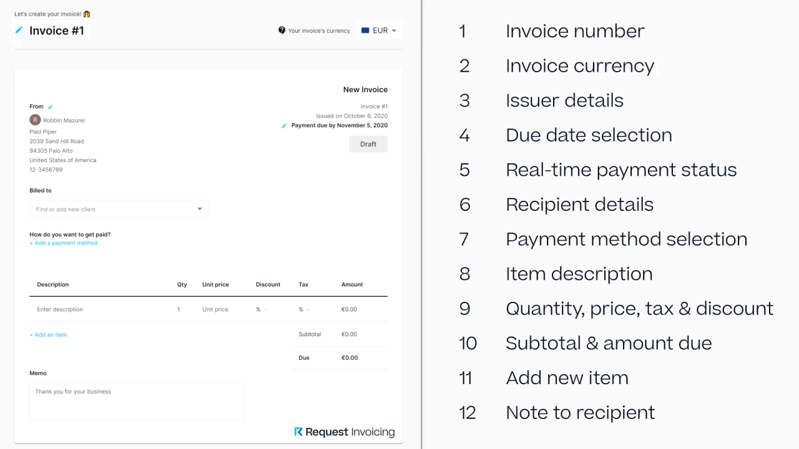

# What is a digital currency invoice?

Request Invoicing is built for anyone that is looking to get paid in digital currencies (cryptocurrency) with compliant invoices while offering the payer a great payment experience.&#x20;

## What it looks like

An invoice issued with Request Invoicing looks very much like the invoice you’re used to now.  It’s compatible with accounting & bookkeeping norms and integrates easily into your existing flows. To show you exactly how it works, we’ve created a cheat sheet going over every section of the invoice below.

### **1. Invoice number**

The number of your invoices can be customized, to make sure they are in sync with your preferred accounting software.

### **2. Invoice currency**

The invoice currency can be adjusted based on the currency you prefer and/or are required to bookkeep in.

We add additional invoice currencies every day.

Current currencies that are supported can be found here: [https://support.request.finance/currencies-supported](https://support.request.finance/currencies-supported)

### **3. Issuer details**

Issuer details can be specified according to local requirements to make your invoice compliant. This includes details such as first & last name, company name & address and tax number.

### **4. Due date selection**

You can select the payment due date according to your needs, giving you a range of options including a customized date.

When untouched, the default due date on an invoice is set to 30 days.

### **5. Real-time payment status**

The payment status field shows you the real-time status of payments associated with your invoice. This is set to draft while creating an invoice and will change to awaiting payment after successfully issuing your invoice to its recipient.

### **6. Recipient details**

The recipient details field specifies to which email the invoice will be sent, and allows you to specify further business details for compliance purpose.

Your client address book automatically saves new clients, so that you can select them next time you issue an invoice towards them.

### **7. Payment method selection**

When creating an invoice, you want to specify how you want to get paid. The payment method selection field allows you to define which (digital) currency you want to receive and the wallet address on which to receive payment.

We’re adding additional support for new currencies on a weekly basis.

Current currencies that are supported can be found here: [https://support.request.finance/currencies-supported](https://support.request.finance/currencies-supported)

### **8. Item description**

The item description field lets you specify in detail which products/services you’re creating an invoice for.

### **9. Quantity, price, tax & discount**

Quantities, prices and tax & discount rates (percentage-based) can be specified per item and are calculated automatically.

### **10. Subtotal & amount due**

The subtotal & amount due field shows the total sum payable for your invoice, taking into account all items and associated quantities, prices, tax & discount rates.

### **11. Add new item**

The add item button allows you to add an additional item to your invoice.

### **12. Note to recipient**

You can attach a note to your invoice to give more details/context, or to simply thank the recipient for doing business with you.
